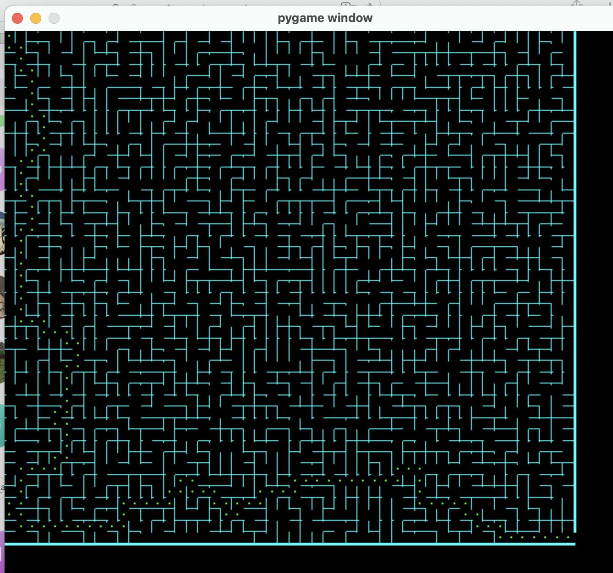

# Генератор Лабиринтов

***Цель:*** написать генератор лабиринтов

***Функционал:***  
 - Генерация с помощью поиска в глубину(DFS) или минимального остовного дерева(MST) 
 - Возможность выбрать параметры генерации через командную строку
 - Возможность задать размеры лабиринта через командную строку 
 - Отображение лабиринта в графическом окне
 - Сохранение/загрузка лвбиринта в/из файлов 
 - Решение лабиринтов и отображение пути
  #
***Использование:***  
В консоле появляется ряд вопросов для задания параметров генерации лабиринтов:
 - **"Save to file after generating? (Y/N)"**.   
Y - да, сохранить.   
N - нет, не сохранять.  
При ответе Y появляется строка **"File name:"** - необходимо ввести файл для сохранения.
Формат файла аналогичен формату для загрузки.


 - **"Get maze from file? (Y/N)"**  
Y - да, загрузить лабиринт из файла.  
N - нет.   
При ответе Y появляется строка **"File name:"** - необходимо ввести файл загрузки.  
Формат файла для считывания: 
      1) Первая строка - ширина
      2) Вторвя строка - высота
      3) Третья строка - наличие стен для клеток в порядке обхода [x][y]:   
   ['bottom', 'left', 'right', 'top']    
   

 - **"Set width and height and cell size:"**  
Необходимо ввести 3 числа через пробел: ширину и высоту лабиринта.


- **"Choose generator type(DFS/MST):"**  
Необходимо выбрать тип построения лабиринта:  
DFS - с помощью поиска в глубину  
MST - с помощью минимального остовного дерева 


- **"Find Path? (Y/N)"**  
Y - да, найти путь прохождения лабиринта  
N - нет, не надо

#
***Запуск и Завершение***  
- Запуск
> git clone git@github.com:cgsg99RF3/MazeGenerator.git &&
> cd MazeGenerator &&   
> git checkout development &&  
> pip install -r requirements.txt &&  
> python3 maze_generator.py 

- Завершение программы  
C помощью крестика в окне рисовки лабиринта

#
***Пример взаимодействия пользователя с программой:*** 
>Save to file after generating? (Y/N)  
>>Y
> 
> File name:  
>> saved_maze.txt  
> 
> Get maze from file? (Y/N)   
>> N
> 
> Set width and height:  
>>13 12   
>
> Choose generator type(DFS/MST):  
>> MST   
>
> Find Path? (Y/N)  
>> Y  

#
***Архитектура:***

**1) Class Params** 
```python
self.glob_sz # min из высоты и ширины окна

self.width  # Высота лабиринта

self.height  # Ширина лабиринта

self.type  # Тип генерации - FROM_FILE(0)/DFS(1)/MST(2) 

self.file_from # Имя файла для чтения лабиринта

self.file_to # Имя файла для сохранения лабиринта
```
```python
def __init__(self, glob_sz)  
```  

**2) Class Cell**
```python
self.x # Позиция x

self.y # Позиция y

self.is_checked # Флаг, был ли алгоритм в клетке 

self.walls # List([bool]) - лист, показывает есть стена или нет

self.size # Размер клетки

self.width # Ширина стен

self.in_path # Принадлежит ли клетка пути прохождения
```
```python
def __init__(self, x : int, y : int)

def get_neighbours(self) -> list # Поиск непроверенных соседей

def get_used_neighbours(self, grid: list) -> list # Поиск проверенных соседей
    
def check(self) -> bool # Проверка, нужно ли идти в клетку

@staticmetod
def is_passage(first : Cell, second : Cell) # Проверка, есть ли путь между клетками

@staticmetod
def is_wall(first : Cell, second : Cell) # Проверка, есть ли стена между клетками

@staticmetod
def set_path(first, second, is_wall) # Создание/Удаление стены между клетками

def draw(self, display): # Рисовка клетки
```
**3) Class Maze**
```python
self.params # Параметры лабиринта

self.grid # Поле лабиринта, List[width * height * cell()]
```
```python
def __init__(self, params : Params) # Инициализация

def draw(self) # Отрисовка лабиринта

def save(self) # Сохранение лабиринта
    
@abstractmetod
def generate(self) # Генерация лабиринта (абстрактный метод)
```
**4) Class DFS_Maze(Maze)**
```python
def generate(self) # Реализация абстрактного метода
```
**5) Class MST_Maze(Maze)**
```python
def generate(self) # Реализация абстрактного метода
```
**7) Class File_Maze(Maze)**
```python
def generate(self) # Реализация абстрактного метода
```
**6) Class Path**
```python
self.used # Массив проверенных вершин

self.counter # Кол-во проверенных вершин
```
```python
def __init__(self, maze : Maze) # Инициализация

def find(self) # Поиск пути
```
#
***Использованный библиотеки:***  
- pygame
- abc


***Примеры лабиринтов (подходят для загрузки):***
- maze1.txt
- maze2.txt 